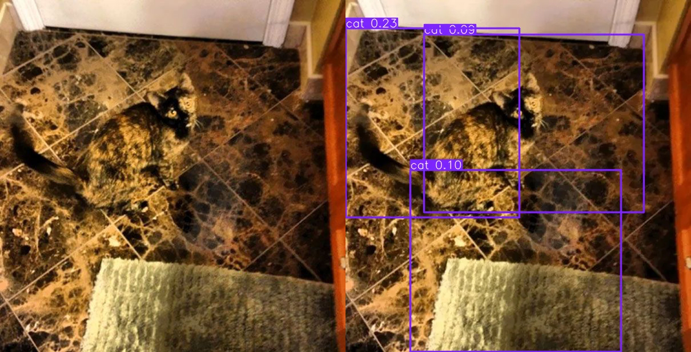

# YOLO-SPiT: Integrating Semantic Superpixels into the YOLO Architecture

This project explores methods for enhancing the YOLO architecture using semantic region information derived from superpixels. The primary goal is to improve detection robustness in challenging scenarios where objects blend into the background or have irregular shapes.

## The Problem: Limitations of Grid-Based Detectors

Modern detectors like YOLO process images as a grid of pixels. While efficient, this can lead to fragmented or inaccurate detections when an object does not conform to a clear rectangular shape.

* Objects blending with the background cause fragmented detections (yolov12n, size 320, conf 0.05)

## The Solution: Leveraging Superpixels

Instead of operating on a grid of pixels, we can first group them into meaningful regions—**superpixels**. This allows the model to access information not just about a pixel's color, but also about its belonging to a specific perceptual object.

This approach is inspired by the **SPiT (Superpixel-based Tokenization)** method, which serves as an alternative to the standard grid-based patching in Vision Transformers.

* Left: Standard square patching. Right: Semantic superpixel tokenization.

---

## Method 1: Adjacency Channels

This is our first and primary integration approach. The core idea is to enrich the input data for YOLO with information about the superpixel structure without fundamentally altering the model's architecture.

**Concept:**
We augment the standard three-channel image (R, G, B) with two additional channels that describe the connectivity between adjacent pixels:

1.  **Vertical Connections:** A pixel has a value of `1` if it and the pixel below it belong to the same superpixel; otherwise, `0`.
2.  **Horizontal Connections:** A pixel has a value of `1` if it and the pixel to its right belong to the same superpixel; otherwise, `0`.

As a result, a 5-channel tensor is fed into the model: `[R, G, B, Vertical_Connections, Horizontal_Connections]`.

*Visual representation of the two new channels added to the original RGB image.*

### Implementation

- **Model Modification:** The first convolutional layer of YOLO was modified to accept a 5-channel input instead of a 3-channel one.
- **Training Strategy:** 